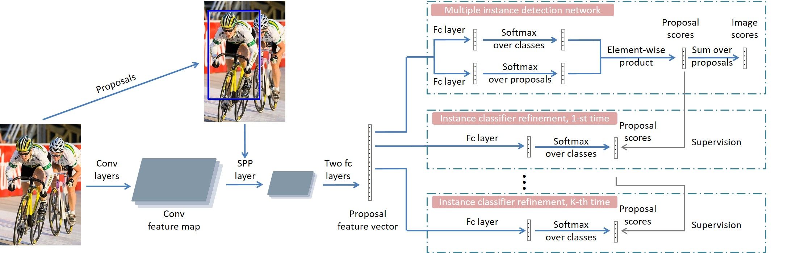
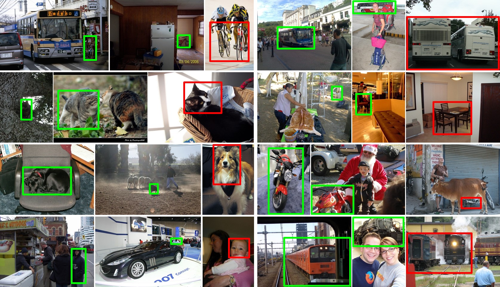
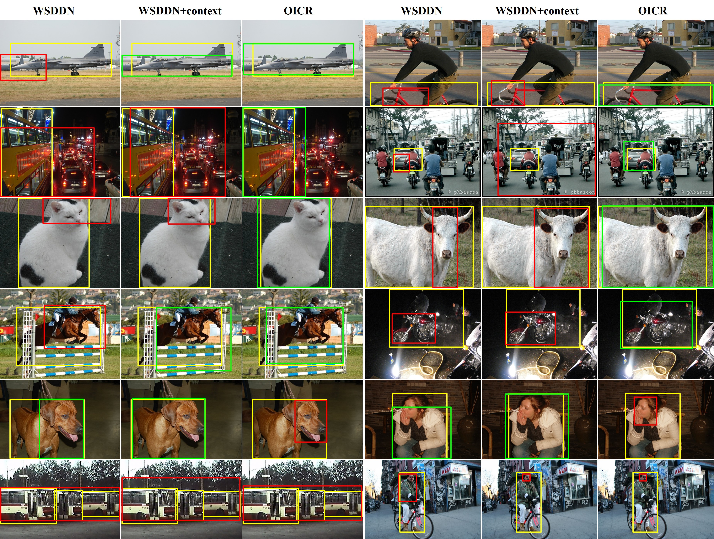

# Multiple Instance Detection Network with Online Instance Classifier Refinement 

By [Peng Tang](https://ppengtang.github.io/), [Xinggang Wang](http://mclab.eic.hust.edu.cn/~xwang/index.htm), [Xiang Bai](http://mclab.eic.hust.edu.cn/~xbai/), and [Wenyu Liu](http://mclab.eic.hust.edu.cn/MCWebDisplay/PersonDetails.aspx?Name=Wenyu%20Liu).

### Introduction

**Online Instance Classifier Refinement (OICR)** is a framework for weakly supervised object detection with deep ConvNets. 
 - It achieves state-of-the-art performance on weakly supervised object detection (Pascal VOC 2007 and 2012).
 - Our code is written by C++ and Python, based on [Caffe](http://caffe.berkeleyvision.org/), [fast r-cnn](https://github.com/rbgirshick/fast-rcnn), and [faster r-cnn](https://github.com/rbgirshick/py-faster-rcnn).

The paper has been accepted by CVPR 2017. For more details, please refer to our [paper](https://arxiv.org/abs/1704.00138).

The code to train and eval OICR using PyTorch as backend is available [here](https://github.com/vadimkantorov/caffemodel2pytorch/blob/master/README.md).
Thanks [Vadim](http://vadimkantorov.com/)!

### Architecture

<p align="left">

</p>

### Results

| Method | VOC2007 test *mAP* | VOC2007 trainval *CorLoc* | VOC2012 test *mAP* | VOC2012 trainval *CorLoc*
|:-------|:-----:|:-------:|:-------:|:-------:|
| OICR-VGG_M | 37.9 | 57.3 | 34.6 | 60.7 |
| OICR-VGG16 | 41.2 | 60.6 | 37.9 | 62.1 |
| OICR-Ens. | 42.0 | 61.2 | 38.2 | 63.5 |
| OICR-Ens.+FRCNN | 47.0 | 64.3 | 42.5 | 65.6 |

### Visualizations

<p align="left">

</p>
Some OICR visualization results.

<p align="left">

</p>
Some visualization comparisons among WSDDN, WSDDN+context, and OICR.

### License

OICR is released under the MIT License (refer to the LICENSE file for details).

### Citing OICR

If you find OICR useful in your research, please consider citing:

    @inproceedings{tang2017multiple,
        Author = {Tang, Peng and Wang, Xinggang and Bai, Xiang and Liu, Wenyu},
        Title = {Multiple Instance Detection Network with Online Instance Classifier Refinement},
        Booktitle = {CVPR},
        Year = {2017}
    }

### Contents
1. [Requirements: software](#requirements-software)
2. [Requirements: hardware](#requirements-hardware)
3. [Basic installation](#installation)
4. [Installation for training and testing](#installation-for-training-and-testing)
5. [Extra Downloads (selective search)](#download-pre-computed-selective-search-object-proposals)
6. [Extra Downloads (ImageNet models)](#download-pre-trained-imagenet-models)
7. [Usage](#usage)

### Requirements: software

1. Requirements for `Caffe` and `pycaffe` (see: [Caffe installation instructions](http://caffe.berkeleyvision.org/installation.html))

  **Note:** Caffe *must* be built with support for Python layers!

  ```make
  # In your Makefile.config, make sure to have this line uncommented
  WITH_PYTHON_LAYER := 1
  ```

2. Python packages you might not have: `cython`, `python-opencv`, `easydict`
3. MATLAB

### Requirements: hardware

1. NVIDIA GTX TITANX (~12G of memory)

### Installation

1. Clone the OICR repository
  ```Shell
  # Make sure to clone with --recursive
  git clone --recursive https://github.com/ppengtang/oicr.git
  ```

2. Build the Cython modules
    ```Shell
    cd $OICR_ROOT/lib
    make
    ```
    
3. Build Caffe and pycaffe
    ```Shell
    cd $OICR_ROOT/caffe-oicr
    # Now follow the Caffe installation instructions here:
    #   http://caffe.berkeleyvision.org/installation.html

    # If you're experienced with Caffe and have all of the requirements installed
    # and your Makefile.config in place, then simply do:
    make all -j 8
    make pycaffe
    ```

### Installation for training and testing
1. Download the training, validation, test data and VOCdevkit

    ```Shell
    wget http://host.robots.ox.ac.uk/pascal/VOC/voc2007/VOCtrainval_06-Nov-2007.tar
    wget http://host.robots.ox.ac.uk/pascal/VOC/voc2007/VOCtest_06-Nov-2007.tar
    wget http://host.robots.ox.ac.uk/pascal/VOC/voc2012/VOCdevkit_18-May-2011.tar
    ```
2. Extract all of these tars into one directory named `VOCdevkit`

    ```Shell
    tar xvf VOCtrainval_06-Nov-2007.tar
    tar xvf VOCtest_06-Nov-2007.tar
    tar xvf VOCdevkit_18-May-2011.tar
    ```
3. It should have this basic structure

    ```Shell
    $VOCdevkit/                           # development kit
    $VOCdevkit/VOCcode/                   # VOC utility code
    $VOCdevkit/VOC2007                    # image sets, annotations, etc.
    # ... and several other directories ...
    ```

4. Create symlinks for the PASCAL VOC dataset

    ```Shell
    cd $OICR_ROOT/data
    ln -s $VOCdevkit VOCdevkit2007
    ```
    Using symlinks is a good idea because you will likely want to share the same PASCAL dataset installation between multiple projects.

5. [Optional] follow similar steps to get PASCAL VOC 2012.

6. You should put the generated proposal data under the folder $OICR_ROOT/data/selective_search_data, with the name "voc_2007_trainval.mat", "voc_2007_test.mat", just as the form of [fast-rcnn](https://github.com/rbgirshick/fast-rcnn).

7. The pre-trained models are all available in the [Caffe Model Zoo](https://github.com/BVLC/caffe/wiki/Model-Zoo). You should put it under the folder $OICR_ROOT/data/imagenet_models, just as the form of [fast-rcnn](https://github.com/rbgirshick/fast-rcnn).

### Download pre-computed Selective Search object proposals

Pre-computed selective search boxes can also be downloaded for VOC2007 and VOC2012.

```Shell
cd $OICR_ROOT
./data/scripts/fetch_selective_search_data.sh
```

This will populate the `$OICR_ROOT/data` folder with `selective_selective_data`.
(The script is copied from the [fast-rcnn](https://github.com/rbgirshick/fast-rcnn)).

### Download pre-trained ImageNet models

Pre-trained ImageNet models can be downloaded.

```Shell
cd $OICR_ROOT
./data/scripts/fetch_imagenet_models.sh
```
These models are all available in the [Caffe Model Zoo](https://github.com/BVLC/caffe/wiki/Model-Zoo), but are provided here for your convenience.
(The script is copied from the [fast-rcnn](https://github.com/rbgirshick/fast-rcnn)).

### Usage

**Train** a OICR_ROOT network. For example, train a VGG16 network on VOC 2007 trainval:

```Shell
./tools/train_net.py --gpu 1 --solver models/VGG16/solver.prototxt \
	--weights data/imagenet_models/$VGG16_model_name --iters 70000
```

**Test** a OICR network. For example, test the VGG 16 network on VOC 2007 test:

#### On trainval
```Shell
./tools/test_net.py --gpu 1 --def models/VGG16/test.prototxt \
  --net output/default/voc_2007_trainval/vgg16_oicr_iter_70000.caffemodel \
  --imdb voc_2007_trainval
```

#### On test
```Shell
./tools/test_net.py --gpu 1 --def models/VGG16/test.prototxt \
  --net output/default/voc_2007_trainval/vgg16_oicr_iter_70000.caffemodel \
  --imdb voc_2007_test
```

Test output is written underneath `$OICR_ROOT/output`.

#### Evaluation
For mAP, run the python code tools/reval.py
```Shell
./tools/reval.py $output_dir --imdb voc_2007_test --matlab
```

For CorLoc, run the python code tools/reval_discovery.py
```Shell
./tools/reval_discovery.py $output_dir --imdb voc_2007_trainval
```


The codes for training fast rcnn by pseudo ground truths are available on [here](https://github.com/ppengtang/fast-rcnn).
